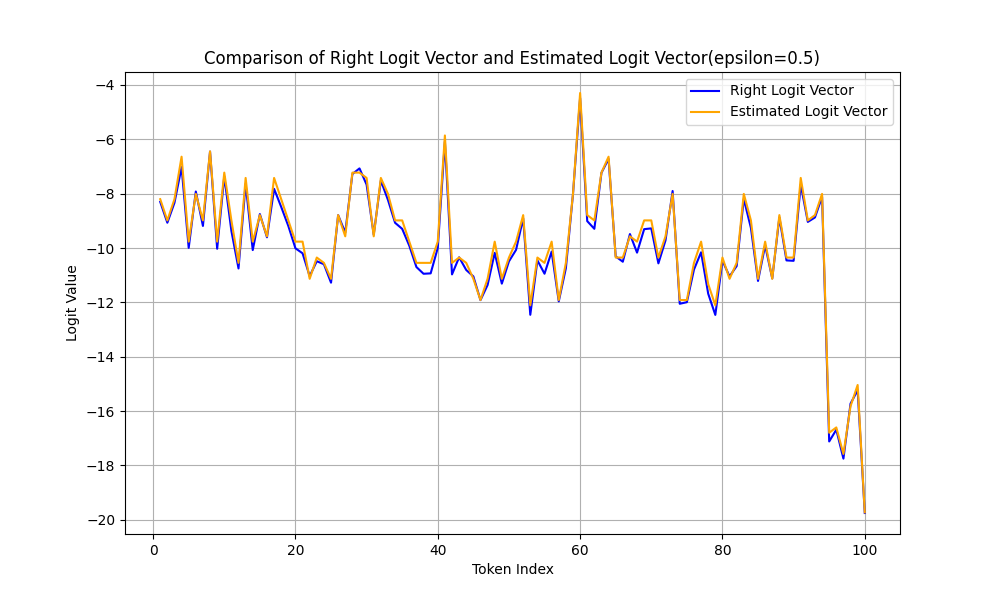

# Stealing Part of a Production Language Model

This repository contains a toy implementation of sections 4.1, 4.2, and 6.1 from the paper 'Stealing Part of a Production Language Model'. The approach allows the last hidden layer to be extracted and logprob-free attack of the model.

## Features
- Extract the last hidden layer of pre-trained language models (e.g., GPT-Neo).
- Extract logits using a basic logprob-free attack.

## Requirements

To install the dependencies, see the `requirements.txt` file.

## Installation

1. Clone the repository:
    ```bash
    git clone <repo-url>
    cd <repo-name>
    ```

2. Create a virtual environment and activate it:
    ```bash
    python -m venv env
    source env/bin/activate  # On Windows use `env\Scripts\activate`
    ```

3. Install the required dependencies:
    ```bash
    pip install -r requirements.txt
    ```

## Usage

1. Run the main script to perform logit extraction:
    ```bash
    python main.py
    ```

2. Modify the script to use different prompts or token ranges, as per your requirements.

### Explanation of Functions
- `get_Q()`: Extracts logits for a set of prompts and constructs matrix Q.
- `dim_extraction()`: Estimates the hidden dimension of the model using SVD on matrix Q.
- `layer_extraction()`: Reconstructs approximate layer weights from the SVD output.
- `binary_search_extraction()`: Performs a binary search to determine the logit value for a target token.

### Visualization Result
Below is a visualization of the singular values extracted during the model analysis and logit vector(id 0-99) comparison between the ground truth and our estimated result:


<div style="display: flex; justify-content: space-evenly; align-items: center; flex-wrap: nowrap;">
    <div style="text-align: center; margin-right: 10px;">
    
    <p>Visualization of the singular values</p>
    </div>
    <div style="text-align: center; margin-right: 10px;">
        
        <p>Logit Vector Comparison (ε = 0.5)</p>
    </div>
    <div style="text-align: center; margin-left: 10px;">
        
        <p>Logit Vector Comparison (ε = 0.05)</p>
    </div>
</div>


## License
[MIT](https://opensource.org/licenses/MIT)

## Acknowledgments
This project is inspired by the paper "Stealing Part of a Production Language Model." Special thanks to the authors and community contributors who have provided the foundational resources.
